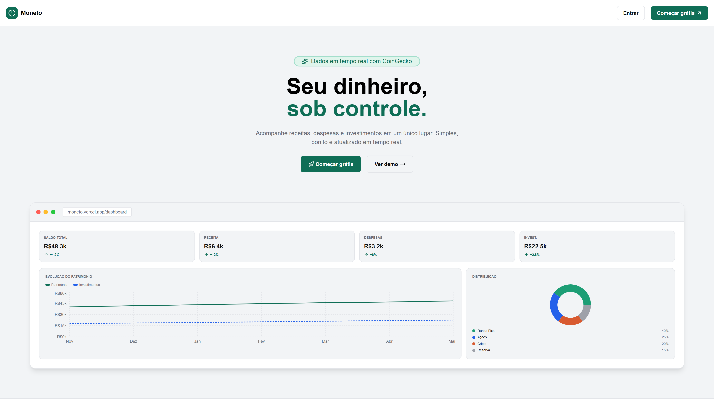
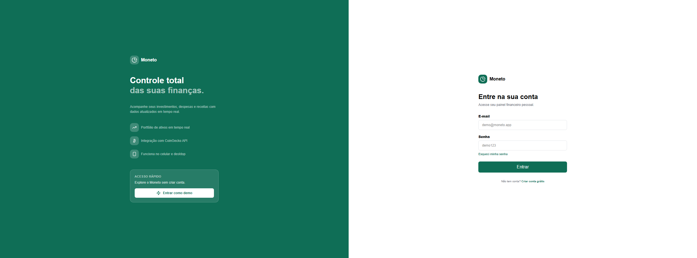
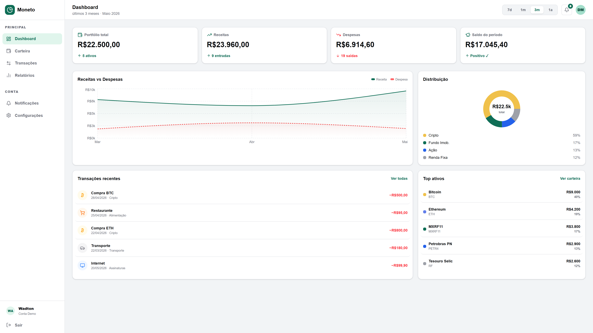
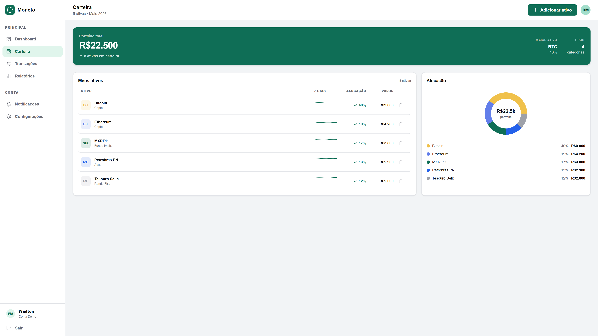
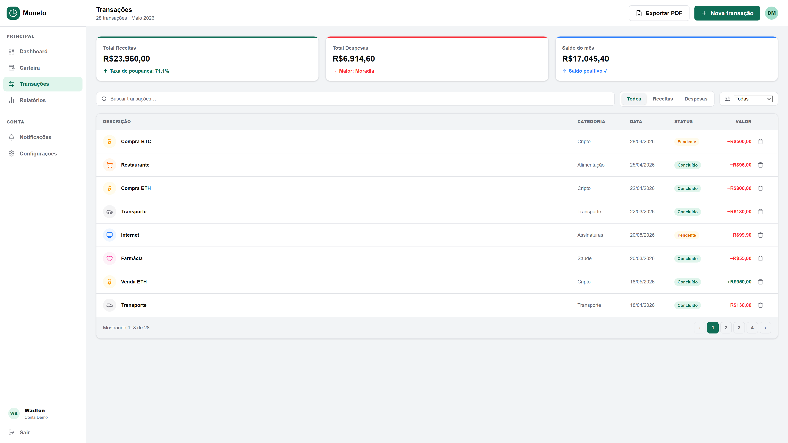
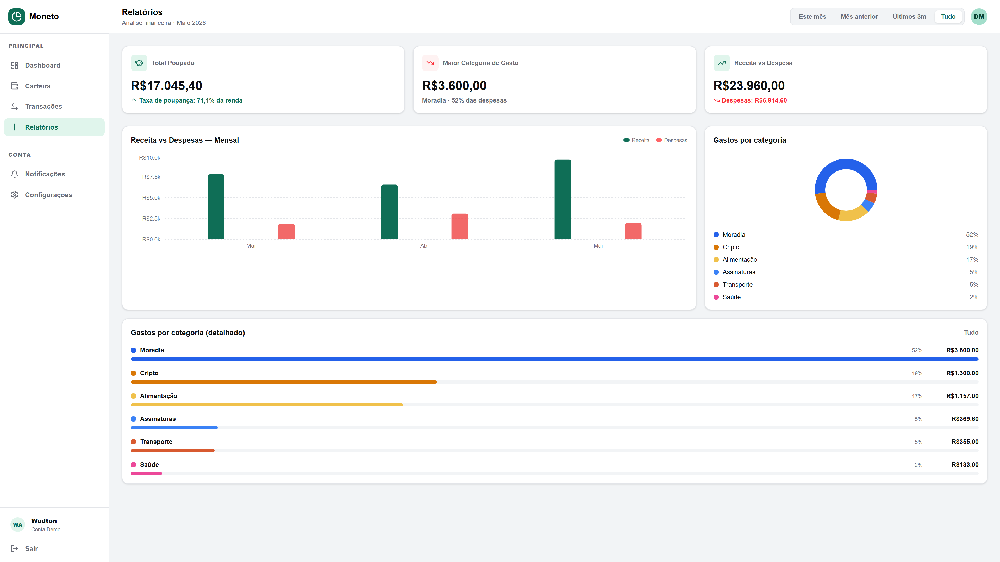
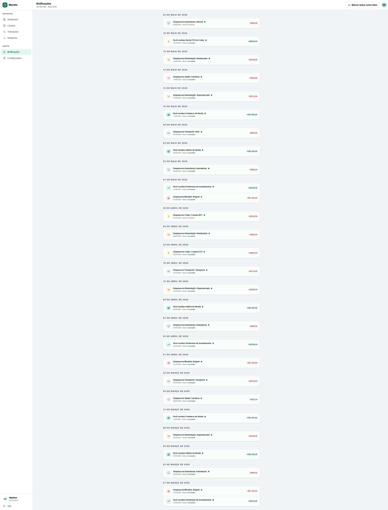
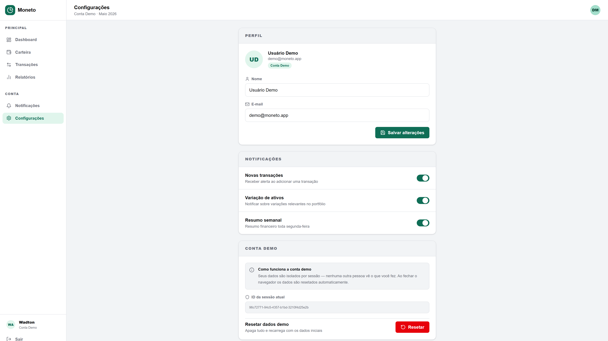

# 💰 Moneto — Dashboard Financeiro Pessoal

> Acompanhe receitas, despesas e investimentos em um só lugar. Simples, bonito e com dados em tempo real.


---

## 📸 Preview

| Welcome | Login | Dashboard |
|---------|-------|-----------|
|  |  |  |

| Carteira | Transações | Relatórios |
|----------|------------|------------|
|  |  |  |

| Notificações | Configurações |
|--------------|---------------|
|  |  |

---

## ✨ Funcionalidades

- **Dashboard** com KPIs, gráfico de evolução do patrimônio e distribuição de ativos
- **Carteira** com lista de ativos e alocação em donut chart
- **Transações** com filtros por tipo, categoria, período e busca
- **Relatórios** com comparativo mensal de receita vs despesas e gastos por categoria
- **Notificações** com agrupamento por data e marcação de lidas
- **Dados em tempo real** via CoinGecko API (cripto) e Frankfurter API (câmbio)
- **Autenticação mockada** com acesso rápido via conta demo
- **Responsivo** — sidebar no desktop, bottom navigation no mobile

---

## 🛠 Tecnologias

| Tecnologia | Uso |
|---|---|
| [Next.js 15](https://nextjs.org/) | Framework principal (App Router) |
| [React 19](https://react.dev/) | Interface e componentes |
| [TypeScript](https://www.typescriptlang.org/) | Tipagem estática |
| [Tailwind CSS v4](https://tailwindcss.com/) | Estilização responsiva |
| [Recharts](https://recharts.org/) | Gráficos de área, barra e donut |
| [Lucide React](https://lucide.dev/) | Ícones |
| [CoinGecko API](https://www.coingecko.com/api) | Preços de criptomoedas (free, sem key) |
| [Frankfurter API](https://www.frankfurter.app/) | Taxas de câmbio (free, sem key) |
| [Vercel](https://vercel.com/) | Deploy e hospedagem |

---

## 📁 Estrutura do Projeto

```
├── app/
│   ├── layout.tsx                 # Layout raiz (fontes, metadata)
│   ├── globals.css                # Variáveis CSS e tokens do design system
│   ├── page.tsx                   # Welcome page "/"
│   ├── favicon.ico
│   │
│   ├── api/
│   │   ├── cripto/route.ts        # Proxy → CoinGecko (evita CORS)
│   │   └── cambio/route.ts        # Proxy → Frankfurter (evita CORS)
│   │
│   ├── (auth)/
│   │   └── login/
│   │       └── page.tsx           # Tela de login
│   │
│   └── (app)/
│       ├── layout.tsx             # Layout com Sidebar + BottomNav + verificação de auth
│       ├── dashboard/page.tsx
│       ├── carteira/page.tsx
│       ├── transacoes/page.tsx
│       ├── relatorios/page.tsx
│       ├── notificacoes/page.tsx
│       └── configuracoes/page.tsx
│
├── components/
│   ├── layout/
│   │   ├── Sidebar.tsx            # Navegação lateral (desktop ≥ 1024px)
│   │   ├── BottomNav.tsx          # Navegação inferior (mobile < 1024px)
│   │   └── Header.tsx             # Cabeçalho reutilizável
│   ├── dashboard/
│   │   ├── PreviewChart.tsx       # Mini gráfico de área
│   │   └── PreviewDonut.tsx       # Mini donut de distribuição
│   └── ui/
│       ├── Avatar.tsx
│       ├── Logo.tsx
│       └── Button.tsx
│
├── lib/
│   ├── demo-db.ts                 # Tipos, constantes de categorias e cores de ativos
│   ├── pdf-export.ts              # Geração de PDF via impressão do navegador
│   ├── session.ts                 # Seed de dados demo no Supabase por sessão
│   ├── supabase.ts                # Configuração do client Supabase
│   └── auth.ts                    # Login mockado com cookie de sessão
│
└── hooks/
    ├── useDemoData.ts             # Dados estáticos de exemplo + CRUD local em memória
    └── useLivePrices.ts           # Preços ao vivo de cripto e câmbio via API proxy
```

---

## 🚀 Como rodar localmente

### Pré-requisitos

- Node.js 18+
- npm ou yarn

### Instalação

```bash
# Clone o repositório
git clone https://github.com/wadtonrdp/Moneto.git
cd Moneto/FRONTEND

# Instale as dependências
npm install

# Rode o servidor de desenvolvimento
npm run dev
```

Acesse [http://localhost:3000](http://localhost:3000) no navegador.

---

## 🔐 Acesso Demo

Não é necessário criar conta. Use o botão **"Entrar como Demo"** na tela de login, ou:

```
E-mail: demo@moneto.app
Senha:  demo123
```

---

## 🌐 APIs utilizadas

### CoinGecko (Cripto)

Acessada via proxy interno em `/api/cripto` para evitar erros de CORS no browser.

```
GET https://api.coingecko.com/api/v3/simple/price
  ?ids=bitcoin,ethereum
  &vs_currencies=brl
  &include_24hr_change=true
```

Sem necessidade de API key. Limite de 30 req/min no plano gratuito.

### Frankfurter (Câmbio)

Acessada via proxy interno em `/api/cambio`.

```
GET https://api.frankfurter.app/latest
  ?from=USD
  &to=BRL
```

Sem necessidade de API key. Atualizado diariamente com dados do BCE.

---

## 📱 Responsividade

| Breakpoint | Layout |
|---|---|
| `< 1024px` (mobile) | Bottom navigation com 6 itens + cards empilhados |
| `≥ 1024px` (desktop) | Sidebar lateral + grid de 2–4 colunas |

A troca é feita com as classes do Tailwind:

```tsx
{/* Sidebar — só no desktop */}
<aside className="hidden lg:flex ...">

{/* Bottom Nav — só no mobile */}
<nav className="flex lg:hidden fixed bottom-0 ...">
```

---

## 🗺 Rotas

| Rota | Descrição | Acesso |
|---|---|---|
| `/` | Welcome / Landing page | Público |
| `/login` | Tela de autenticação | Público |
| `/dashboard` | Visão geral do portfólio | Autenticado |
| `/carteira` | Ativos e alocação | Autenticado |
| `/transacoes` | Histórico de transações | Autenticado |
| `/relatorios` | Análise financeira mensal | Autenticado |
| `/notificacoes` | Histórico de alertas por data | Autenticado |
| `/configuracoes` | Perfil e opções da conta demo | Autenticado |

A verificação de autenticação é feita no `app/(app)/layout.tsx`, que redireciona para `/login` caso não haja sessão ativa.

---

## 📦 Scripts disponíveis

```bash
npm run dev      # Servidor de desenvolvimento
npm run build    # Build de produção
npm run start    # Inicia o build de produção
npm run lint     # Verifica erros de lint
```

---

## 🚢 Deploy

O projeto está configurado para deploy automático na **Vercel**.

```bash
# Via Vercel CLI
npm i -g vercel
vercel
```

Ou conecte o repositório diretamente pelo [painel da Vercel](https://vercel.com/new).

---

## 👨‍💻 Autor

**Wadton Alves**

Estudante de Análise e Desenvolvimento de Sistemas — UniSenai Cuiabá, MT.

[](https://wadton-dev.vercel.app)
[](https://www.linkedin.com/in/wadtonrdp)
[](https://github.com/wadtonrdp)

---

## 📄 Licença

Este projeto é open source e está disponível sob a licença [MIT](LICENSE).

---

> Projeto desenvolvido para composição de portfólio — 2026
